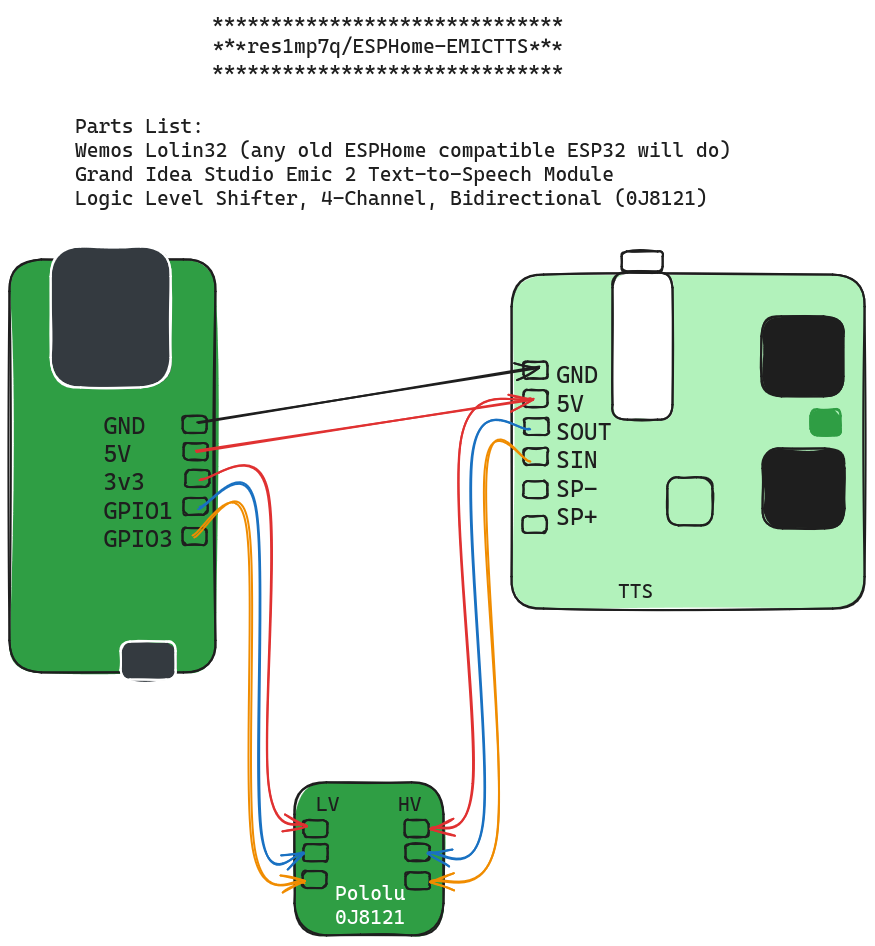

ESPHome EMIC Text to Speech Module

The inspiration for this was this scene from Back to the Future II ( https://youtu.be/Z2OLmFw9wR8?si=AEyfZgfXBqFM3eei&t=189 )

This is an ESPHome YAML configuration for integrating the EMIC Text to Speech module with your ESPHome project. Used in conjuction with Home Assistant and MQTT, was able to have the EMIC yelp out ridiculous statements to remind people how nerds live. 

With this configuration, you can easily convert text to speech using the EMIC module, enabling your ESPHome device to speak messages aloud.
Requirements

Prereqs:
    Home Assistant, MQTT, and ESPHome installed and set up on your development environment.
    EMIC Text to Speech module *properly* connected to your ESPHome device.

Installation

    Parts List:
    Wemos Lolin32 (any old ESPHome compatible ESP32 will do)
    Grand Idea Studio Emic 2 Text-to-Speech Module
    Logic Level Shifter, 4-Channel, Bidirectional (0J8121)

The Logic shifter is needed to convert the GPIO serial output to a usable level for the EMIC. Pololu makes by far the smallest and cleanest on the earth - and its Americuh made!

Make sure you use the same ground for both the ESP32 and EMIC. 

    Clone or download this repository to your local machine.
    Copy the emic_text_to_speech.yaml file into your ESPHome project directory.

Usage

    Open your ESPHome project configuration file (usually named your_project_name.yaml).

    Include the emic_text_to_speech.yaml file using the !include directive:

    yaml

!include emic_text_to_speech.yaml

For more information on configuring ESPHome and using the EMIC Text to Speech module, refer to the ESPHome documentation.
License

This project is licensed under the MIT License.