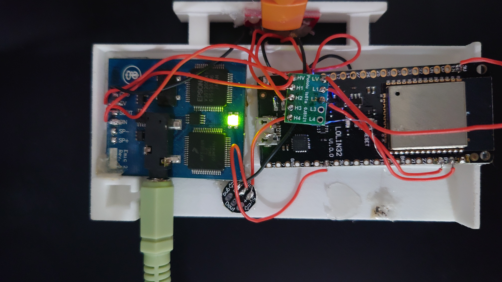

ESPHome EMIC Text to Speech Module

The inspiration for this was this scene from Back to the Future II ( https://youtu.be/Z2OLmFw9wR8?si=AEyfZgfXBqFM3eei&t=189 )

This is an ESPHome YAML configuration for integrating the EMIC Text to Speech module with your ESPHome project. Used in conjuction with Home Assistant and MQTT, was able to have the EMIC yelp out ridiculous statements to remind people how nerds live. 

With this configuration, you can easily convert text to speech using the EMIC module, enabling your ESPHome device to speak messages aloud.
Requirements

Prereqs:
    Home Assistant, MQTT, and ESPHome installed and set up on your development environment.
    EMIC Text to Speech module *properly* connected to your ESPHome device.

Installation

    Clone or download this repository to your local machine.
    Copy the emic_text_to_speech.yaml file into your ESPHome project directory.

Usage

    Open your ESPHome project configuration file (usually named your_project_name.yaml).

    Include the emic_text_to_speech.yaml file using the !include directive:

    yaml

!include emic_text_to_speech.yaml

Configure the emic_text_to_speech component according to your setup:

yaml

emic_text_to_speech:
  tx_pin: GPIO12
  rx_pin: GPIO13

Replace GPIO12 and GPIO13 with the appropriate pins connected to your EMIC module.

Add a text_sensor entity to your configuration to provide the text you want to convert to speech:

yaml

text_sensor:
  - platform: homeassistant
    name: "Speech Text"
    id: speech_text

Finally, use the tts.say service to trigger text-to-speech conversion:

yaml

    script:
      - id: say_hello
        then:
          - tts.say:
              id: tts_say
              text: "Hello, world!"

    Upload the modified configuration to your ESPHome device and enjoy text-to-speech capabilities!

For more information on configuring ESPHome and using the EMIC Text to Speech module, refer to the ESPHome documentation.
License

This project is licensed under the MIT License.